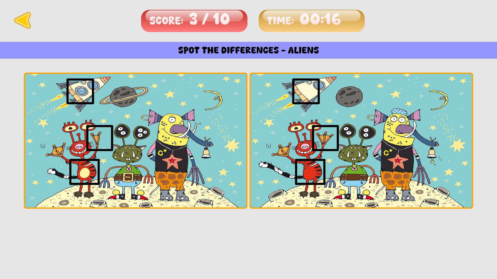

# Spot the Difference

A Spot the Difference game made as an assignment for Eklavya.me for selection in an internship.

## Live Website

[Try it here](https://spot-the-diff.netlify.app/)

## Installation

To get a local copy up and running, follow these simple steps.

1. **Clone the repo**

    ```bash
    git clone https://github.com/satzch/spot-the-difference-eklavya.git
    ```

2. **Open the `index.html` file**
   - You can open the file directly in a web browser.
   - Or go to the file in your file browser and double click to open it in your default browser or right click and select the desired browser to open with.

## Screenshot



## How to Play

- Find the differences in the images and click on the difference

## Technologies Used

- HTML, CSS, HTML Canvas
- JavaScript

## Image Credits

- Easter Images: [abby-design] ([Vecteezy](https://www.vecteezy.com/vector-art/19979698-child-basket-of-easter-eggs-find-the-differences))
- Alien Images: [belozerovkids] ([Pixabay](https://pixabay.com/illustrations/spot-the-difference-puzzle-7096958/))

## How JSON is used here?

- The JSON is a list of level objects
- Each Level object contain level id, level title, the images, and a list of bounding box description for each differences in the images.
- The JSON file is hosted in github and fetched in the game to utilise it.
- The JSON file can be changed or modified to make new levels or modify old levels without changing any code.
- Look at the [JSON file](./assets/json/data.json) for the structure.

All artwork and resources used in this project are free to use.
